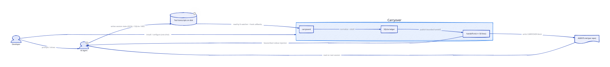
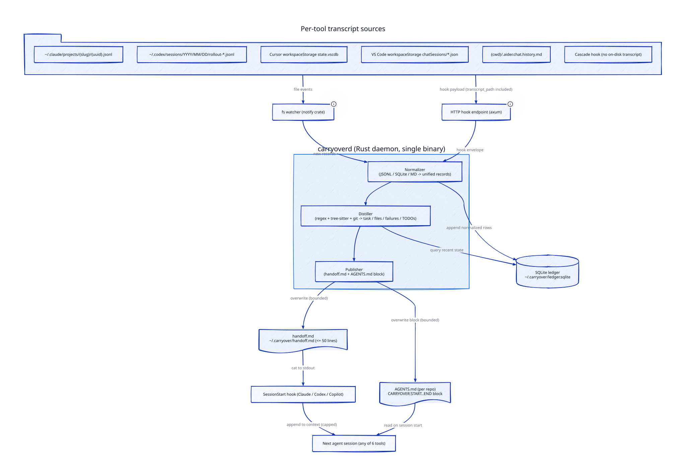
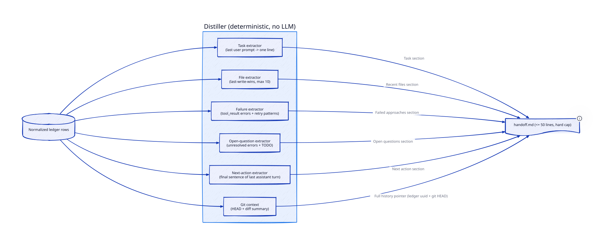
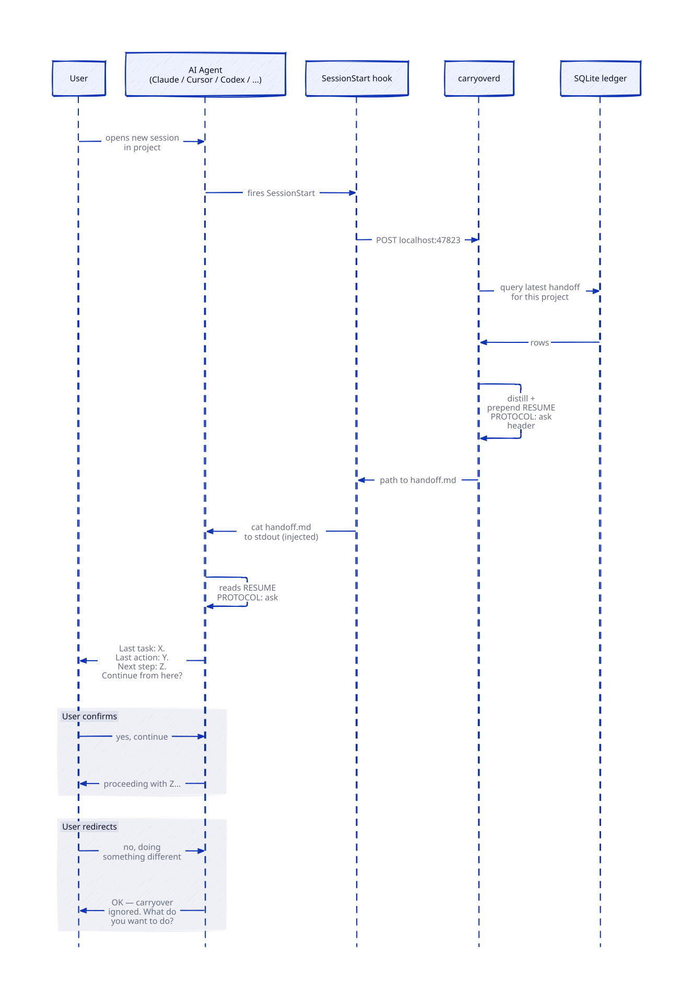

# Carryover Architecture

> Source of truth for system design. Read this before making architectural decisions.
> Diagrams: `architecture/d2/` (editable `.d2` source + rendered `.svg`)

**Goal:** Keep AI agents on-task across sessions, tool switches, and compaction events — without burning context. The agent surface is developer-tools (Claude Code, Cursor, Codex, Copilot, Windsurf, Aider) but the work users do inside them spans code, research, founder work, and long-form writing. Success metric: a user can close any supported agent, open another (same tool or different), and the new agent picks up the previous task in under 50 lines of injected handoff — regardless of domain.

---

## L1 — System Context



### Actors


| Actor               | Who                                                              | What They Do                                                                                             |
| ------------------- | ---------------------------------------------------------------- | -------------------------------------------------------------------------------------------------------- |
| **AI Agent** | Any of: Claude Code, Cursor, Codex CLI, Copilot, Windsurf, Aider — used for code, research, founder work, writing, or any long-running task | Writes session state to disk as a side effect of operating; reads injected handoff on next session start |
| **Developer**       | One person per machine                                           | Drives the agent. Installs Carryover once; never has to think about it again                             |


### Platform Domains


| Domain            | Purpose                                                                        | Key Tech                                     |
| ----------------- | ------------------------------------------------------------------------------ | -------------------------------------------- |
| **Capture**       | Pick up new state from each agent's transcripts as it's written                | `notify` fs watcher, axum HTTP hook endpoint |
| **Normalization** | Convert each tool's wire format into a unified ledger schema                   | Rust + serde, SQLite                         |
| **Distillation**  | Extract a bounded summary from the ledger — task, files, failures, next action | Regex, tree-sitter, git plumbing             |
| **Publishing**    | Write the handoff to where the next agent will see it                          | File writes to `handoff.md` and `AGENTS.md`  |


### External Systems


| System                                            | Role                                                 | Integration                                                                           |
| ------------------------------------------------- | ---------------------------------------------------- | ------------------------------------------------------------------------------------- |
| **Each agent's hook system**                      | Real-time triggers (e.g. `PreCompact`, `SessionEnd`) | One-line `curl localhost:47823` stub written into the tool's settings file at install |
| **Each agent's transcript path**                  | Authoritative session state                          | Read-only file access on disk                                                         |
| **Local SQLite**                                  | Persistent ledger                                    | Single file at `~/.carryover/ledger.sqlite`                                           |
| `**AGENTS.md`** ([agents.md](https://agents.md/)) | Cross-tool restore rail                              | Bounded marker block, overwritten each snapshot                                       |


### Key Data Flows (L1)


| From             | To               | What                          | Format                                      |
| ---------------- | ---------------- | ----------------------------- | ------------------------------------------- |
| Agent            | Transcript file  | Session state (every turn)    | JSONL / SQLite / Markdown — varies per tool |
| Transcript file  | Carryover daemon | Captured deltas               | Tool-native format                          |
| Carryover daemon | Handoff file     | Distilled summary (≤50 lines) | Markdown                                    |
| Handoff file     | Next agent       | Restore                       | Stdout injection or AGENTS.md block         |


---

## L2 — Containers & Data Flow



### Capture


| Container              | Tech                        | What It Does                                                                              |
| ---------------------- | --------------------------- | ----------------------------------------------------------------------------------------- |
| `**carryoverd**`       | Rust, single binary         | Long-lived user daemon. Started by `launchd` (macOS) or `systemd --user` (Linux) at login |
| **fs watcher**         | `notify` crate              | Cross-platform fs events on each tool's transcript directory                              |
| **HTTP hook endpoint** | `axum` on `localhost:47823` | Receives JSON envelopes from one-line hook stubs in each tool's settings                  |
| **`ToolSpec` resolver** | Rust + `semver`             | Owns version detection per tool and the per-version `HookSet` / path tables. Used by `carryover install` and `carryover refresh` to write correct stubs for the user's installed tool versions |


### Normalization & Distillation


| Container      | Tech                                  | What It Does                                                                  |
| -------------- | ------------------------------------- | ----------------------------------------------------------------------------- |
| **Normalizer** | Rust + serde + SQLite                 | Converts JSONL / Cursor SQLite rows / Aider Markdown into unified ledger rows. Per-tool adapters filter by line `type` — not every JSONL line is a conversation turn (e.g. macOS Claude Code emits `file-history-snapshot` rows alongside `user`/`assistant` rows). |
| **Distiller**  | Rust + `tree-sitter` + regex + `git`  | Deterministic extraction of task / files / failures / TODOs / next-action     |
| **Ledger**     | SQLite (`~/.carryover/ledger.sqlite`) | Append-only normalized record. One file. Portable.                            |


### Publishing


| Container     | Tech         | What It Does                                                                                             |
| ------------- | ------------ | -------------------------------------------------------------------------------------------------------- |
| **Publisher** | Rust file IO | Writes the 50-line payload to `~/.carryover/handoff.md` (global) and `<project>/.carryover/handoff.md` (project-local, gitignored). Writes the **static pointer block** to `<project>/AGENTS.md` and `<project>/CLAUDE.md`. Sensitive task content never lands in committed files. |


### Cross-Domain Data Flows (L2)


| From                        | To                         | Data                                                           | Purpose                   |
| --------------------------- | -------------------------- | -------------------------------------------------------------- | ------------------------- |
| Agent transcript (any tool) | fs watcher / hook endpoint | Append-only deltas + hook envelopes carrying `transcript_path` | Capture                   |
| fs watcher / hook endpoint  | Normalizer                 | Raw records                                                    | Convert to unified schema |
| Normalizer                  | Ledger                     | Normalized rows                                                | Persistent store          |
| Distiller                   | Ledger                     | Read recent rows                                               | Build the bounded summary |
| Publisher                   | `handoff.md` + `AGENTS.md` | Overwritten markdown                                           | Restore rail              |


### Confirmed Transcript Locations


| Tool              | Path                                                                                  | Format                                                                         |
| ----------------- | ------------------------------------------------------------------------------------- | ------------------------------------------------------------------------------ |
| Claude Code       | `~/.claude/projects/<cwd-slug>/<uuid>.jsonl`                                          | JSONL, append-only, git-DAG schema                                             |
| Codex CLI         | `~/.codex/sessions/YYYY/MM/DD/rollout-*.jsonl`                                        | JSONL                                                                          |
| Copilot (VS Code) | `~/Library/Application Support/Code/User/workspaceStorage/<hash>/chatSessions/*.json` | JSON per session                                                               |
| Cursor            | `~/Library/Application Support/Cursor/User/workspaceStorage/<hash>/state.vscdb`       | SQLite (`composer.composerData`, `aiService.prompts`, `aiService.generations`) |
| Aider             | `$CWD/.aider.chat.history.md` + `.aider.llm.history`                                  | Markdown + plaintext                                                           |
| Windsurf          | **No disk transcript exposed**                                                        | Captured via Cascade hook to Carryover's own store                             |


### Hook Trigger Surface


| Tool        | Hook Config Path                                       | Key Events                                                                                                                                          |
| ----------- | ------------------------------------------------------ | --------------------------------------------------------------------------------------------------------------------------------------------------- |
| Claude Code | `~/.claude/settings.json`, `.claude/settings.json`     | `SessionStart`, `UserPromptSubmit`, `PreToolUse`, `PostToolUse`, `Stop`, `**PreCompact`**, `PostCompact`, `SessionEnd`, `FileChanged`, `CwdChanged` |
| Cursor      | `~/.cursor/hooks.json`, `.cursor/hooks.json`           | `sessionStart`, `beforeSubmitPrompt`, `beforeShellExecution`, `afterFileEdit`, `stop`                                                               |
| Codex       | `~/.codex/config.toml`                                 | `SessionStart`, `UserPromptSubmit`, `PreToolUse`, `PostToolUse`, `PermissionRequest`, `Stop`                                                        |
| Copilot     | `.github/hooks/*.json` (via `chat.hookFilesLocations`) | `SessionStart`, `UserPromptSubmit`, `PreToolUse`, `PostToolUse`, `**PreCompact**`, `SubagentStart`, `SubagentStop`, `Stop`                          |
| Windsurf    | Cascade Hooks (v1.12.41+)                              | Pre-prompt, post-response                                                                                                                           |
| Aider       | **No hook system**                                     | Env vars + CLI flags only                                                                                                                           |


`PreCompact` is Carryover's "save yourself before you die" signal — Claude Code and Copilot both expose it, the exact moment before context is truncated.

---

## L3 — Distiller Internals



### Distiller pipeline


| Stage                       | Input                                                              | Output                                                        |
| --------------------------- | ------------------------------------------------------------------ | ------------------------------------------------------------- |
| **Task extractor**          | Most recent user prompt rows                                       | One-line task summary                                         |
| **File extractor**          | `tool_use` rows that touched files (last-write-wins, capped at 10) | List of recently edited files with timestamps and test status |
| **Failure extractor**       | `tool_result` rows tagged as errors plus retry-pattern matches     | List of attempted approaches that did not work, with reason   |
| **Open-question extractor** | Unresolved tool errors + explicit `TODO` / `FIXME` lines           | Outstanding decisions for the next agent                      |
| **Next-action extractor**   | Final sentence of the most recent assistant turn                   | One-line "do this next"                                       |
| **Git context**             | `git rev-parse HEAD` + `git diff --stat`                           | Commit pointer + diff summary for the ledger pointer          |


### Domain-aware extractors

The work users do inside these agents spans code, research, founder strategy, and long-form writing. The extractors above are split between **always-on** (work for any conversation) and **coding-only** (activate when the session has code-tool signals):

| Extractor | Domain | When it fires |
|---|---|---|
| Task / topic | always-on | Every session |
| Open questions | always-on | Every session |
| Next action | always-on | Every session |
| Recent files | coding-only | If `tool_use` rows touched files |
| Failed approaches | coding-only | If `tool_result` rows had errors |
| Git context | coding-only | If `git` is callable in the cwd |

Future versions will add more **always-on** extractors aimed at non-coding work — *decisions made* (regex on patterns like "we decided X because Y"), *references* (URLs, citations, document mentions), and *action items* (assignments, TODOs in prose). The contract stays the same: the handoff is useful whether the session was a Rust panic or a Series A pitch.


### Handoff template (≤50 lines, hard cap)

```markdown
# [CARRYOVER] Last updated <ISO> from <tool>

## Task
<one line from last user prompt>

## Recent files (last-write-wins, max 10)
- src/foo.ts — edited 3 min ago
- src/bar.test.ts — edited 7 min ago, tests failing

## Failed approaches (extracted from tool errors + retry patterns)
- Tried passport.js — conflicted with existing middleware
- Tried widening TS types — silenced error, broke runtime

## Open questions
<extracted from unresolved tool errors or explicit TODOs>

## Next action
<pulled from most recent assistant turn's final sentence>

## Full history
See: ~/.carryover/ledger.sqlite (session <uuid>)
```

### Restore paths

**Path 1 — `SessionStart` stdout injection** (Claude Code, Codex, Copilot)

- Hook on `SessionStart` runs `cat ~/.carryover/handoff.md`
- The 50-line handoff is appended to context — not the full transcript
- Bounded, never grows

**Path 2 — split: static pointer in `AGENTS.md` + `CLAUDE.md`, payload in gitignored `.carryover/handoff.md`** (all six tools)

To keep in-flight task state out of commits, the handoff is split across two layers:

| Layer | File | Committed? | Content |
|---|---|---|---|
| **Pointer** | `<project>/AGENTS.md` + `<project>/CLAUDE.md` (bounded `[CARRYOVER]` block) | Yes — safe to commit | **Static** pointer text. Tells the agent to read `.carryover/handoff.md` if it exists. Same in every project. Never contains task data. |
| **Payload** | `<project>/.carryover/handoff.md` | **No — auto-gitignored at first encounter** | The actual 50-line handoff with task content (failed approaches, file paths, open questions, business context). Overwritten every snapshot. |

The pointer block (fixed text, never changes per-snapshot):

```
<!--CARRYOVER:START-->
# Carryover handoff

If `.carryover/handoff.md` exists in this project, read it before starting
work — it contains a bounded handoff from the previous session.

If that file does not exist, no recent session was captured.
<!--CARRYOVER:END-->
```

The payload (`.carryover/handoff.md`, gitignored):

```
# [CARRYOVER] Last updated <ISO> from <tool>

# RESUME PROTOCOL: ask
<meta-instruction>

## Task
<task summary>

... 50 lines of actual session state ...
```

**Why split instead of putting the handoff directly in `AGENTS.md`?**

`AGENTS.md` and `CLAUDE.md` are typically committed because they hold contributor conventions. Embedding the 50-line handoff in them meant every snapshot could end up in `git log` if the user committed without thinking — leaking task state, failed approaches, file paths, and sometimes business context (e.g. a fundraising deadline mentioned mid-session) into the public history. The split makes the safe behavior automatic: sensitive content lives only in a gitignored file from the moment it's first written. The committed pointer block is fixed text — harmless to commit forever.

**Both files still get the pointer block** because Claude Code reads only `CLAUDE.md` natively while the other five tools read `AGENTS.md`. The pointer is the same in both — single source of truth for the payload, dual-written to whichever file the agent looks at.

### Resume protocol



The handoff is not silently injected. The next agent's first move is to summarize what carried over and ask the user to confirm — so a stale or wrong handoff fails fast instead of polluting a new task.

Three modes, configured at install time and overridable per-project via `.carryover.toml`:

| Mode | Behavior | When to use |
|---|---|---|
| **`ask`** (default) | Agent's first message summarizes the handoff (task + last action + next step) and asks: *"Do you want to continue from here, or are you starting something different?"* Does not begin work until the user confirms. | Default — catches stale handoffs |
| **`brief`** | Agent prefixes its first response with `(resuming: <task>)` but does not gate. | Power users who trust the handoff but want visibility |
| **`silent`** | Handoff is treated purely as background context. No surfacing. | Power users who closed deliberately and want to keep moving |

The mode is enforced by a meta-instruction header at the top of the injected handoff. For `ask` mode:

```markdown
# RESUME PROTOCOL: ask
Your first response in this session MUST be:
1. A two-sentence summary of the task and the next planned action.
2. The question: "Do you want to continue from here, or are you starting something different?"
Do not begin work until the user confirms.
```

Models reliably follow these instructions when they sit at the top of the injected context.

---

## End-to-end flow

This walks through what happens from a user's first install to the next session resuming with a handoff. Each step labels what is **automatic** vs what the user does.

### 1. Install (one-time, system-level — minimal user input)

User runs `brew install carryover` (or `npm i -g carryover`), then `carryover install`.

The user is asked **one question only**: which tools do they use. Everything else — config file paths, hook event names, transcript paths — is auto-detected from the per-tool specs that ship inside Carryover.

**Flow**:

1. **Show the picker.** A single checkbox list pre-checked with detected tools:

   ```
   Which AI agents do you use? (space to toggle, enter to confirm)
     [x] Claude Code     detected
     [x] Cursor          detected
     [ ] Codex CLI       detected
     [ ] Copilot         not detected (deferred to v0.2)
     [ ] Windsurf        not detected (deferred to v0.2)
     [ ] Aider           not detected (deferred to v0.2)
   ```

   The user confirms or adjusts. Tools the user does not select are never touched.

2. **Auto-detect per selected tool.** For each tool the user picked, Carryover:
   - Resolves the binary on `PATH` (first match from a known list)
   - Reads its version (`<tool> --version` or equivalent)
   - Looks up the matching `ToolSpec` from the built-in version table (see "Per-tool version specs" below)
   - Resolves the config file path (OS-aware candidates, first existing wins; create at the standard location if none exist)
   - Resolves the transcript directory the same way
   - Picks the right hook event names for the detected version

3. **Write hook stubs** with the version-correct event names — silently, but a per-tool summary is printed:

   ```
   ✓ Claude Code 1.4.2 detected
     config: ~/.claude/settings.json
     hooks written: SessionStart, SessionEnd, PreCompact

   ✓ Cursor 0.42.1 detected
     config: ~/.cursor/hooks.json
     hooks written: sessionStart, stop
   ```

4. **Save selections** to `~/.carryover/config.toml`. (Just *which tools the user wants covered* — not paths or hook names. Those belong to the version specs.)

5. **Register the daemon** to start at login (`launchd` macOS, `systemd --user` Linux).

6. **Start the daemon** and verify the hook endpoint at `localhost:47823`.

**User does**: ticks the box for each tool they actually use. That's it. They never have to find a config path, name a hook event, or know what JSON fragment to insert.

### Failure modes surfaced honestly

```
✗ Codex CLI selected but not detected on this machine.
  Skipped. Re-run `carryover refresh` after installing it.

⚠ Cursor 0.99 detected — newer than Carryover's known versions.
  Falling back to the last-known hook names (Cursor 0.42).
  Update Carryover when you can: `brew upgrade carryover`.
```

The user is told when something didn't work and what to do next. They are never asked to manually fix an install detail.

### Re-detect later: `carryover refresh`

When the user installs a new agent, upgrades one whose hook names or config path changed, or wants to add/remove a tool:

```bash
carryover refresh
```

Re-runs the picker with the previous selections pre-checked. Re-resolves each tool's version, config path, and hook names from the version specs. Applies the deltas (writes new stubs for newly-checked tools, removes stubs for unchecked tools, rewrites stubs whose hook names changed in a new version). Idempotent.

`carryover status` (sibling command, lower priority) shows the current resolved configuration without changing anything.

### 2. First session in a project

User opens any supported agent in `/path/to/project/`.

**Automatic**:

- Agent's `SessionStart` hook fires.
- Hook posts to `localhost:47823/hook/<tool>/sessionstart` with the project path.
- Daemon ensures the project's privacy split is in place:
  - Creates `<project>/.carryover/` if missing.
  - Adds `.carryover/` to the project's `.gitignore` if not already present (idempotent — only one line is added, with a `# Carryover (auto-added)` comment).
  - Creates `<project>/.carryover/handoff.md` with a placeholder if missing.
- Daemon ensures the pointer block is in `<project>/AGENTS.md` and `<project>/CLAUDE.md`:
  - If a file is missing, creates it with the static pointer block.
  - If a file exists but has no `[CARRYOVER]` block, appends the static pointer block — leaves all other content alone.
  - If a file already has the `[CARRYOVER]` block, leaves it alone (the pointer text never changes per-snapshot).
- Daemon checks the ledger for prior sessions in this project.
  - If found: the marker block is populated with the latest handoff (with the meta-instruction header per the configured resume mode).
  - If not found: the marker block contains a "no prior session captured" placeholder.
- Agent reads `AGENTS.md` natively (see the per-tool matrix below).

**User does**: nothing.

### 3. During the session

**Automatic**:

- Each user prompt and tool call appends to the agent's transcript on disk.
- fs watcher picks up the change → daemon ingests new ledger rows in microseconds.
- At intervals (or when triggered by `UserPromptSubmit` / `PostToolUse` hooks), the daemon re-runs the distiller and republishes the handoff.
- The agent never sees any of this. No bookkeeping inside the agent's context.

**User does**: nothing.

### 4. Compaction or session end

**Automatic**:

- Agent fires `PreCompact` (about to truncate context) or `SessionEnd` (user closed).
- Hook posts to `localhost:47823` immediately, *before* context is lost.
- Daemon snapshots the current ledger state, runs the distiller, and writes:
  - `~/.carryover/handoff.md` (≤50 lines)
  - The `[CARRYOVER:START..END]` block in the project's `AGENTS.md`.

**User does**: nothing.

### 5. Next session

User opens any supported agent in the same project — same tool, different tool, or a fresh session of the same tool.

**Automatic**:

- `SessionStart` hook fires.
- Two restore paths execute in parallel:
  - **Path 1**: Hook runs `cat ~/.carryover/handoff.md`; stdout is injected into the agent's context (Claude Code, Codex, Copilot).
  - **Path 2**: The agent reads `AGENTS.md` from the project root and sees the `[CARRYOVER]` block (all six tools).
- The agent's first response follows the configured resume protocol. In default `ask` mode: summarize the handoff and ask the user to confirm continuation.

**User does**: confirms or redirects.

### Per-tool version specs (the source of truth for hook names + paths)

Carryover ships a built-in **`ToolSpec` table** mapping each supported tool's version range to the hook event names, config file location candidates, and transcript directory candidates that version uses. Sketch:

```rust
struct ToolSpec {
    name: &'static str,
    detect_binary:    &'static [&'static str],     // ["claude", "claude-code"]
    detect_version:   fn(&Path) -> Option<Version>,
    config_paths:     &'static [PathSpec],         // OS-aware candidates
    transcript_paths: &'static [PathSpec],
    hooks_by_version: &'static [(VersionRange, HookSet)],
}

struct HookSet {
    session_start: &'static str,           // "SessionStart" for Claude 1.2+
    session_end:   &'static str,
    pre_compact:   Option<&'static str>,   // None where not exposed
    user_prompt_submit: Option<&'static str>,
    // ...
}
```

When the user selects a tool, the daemon:
1. Resolves the binary (first hit from `detect_binary`)
2. Calls `detect_version` (e.g. parses `claude --version`)
3. Picks the `HookSet` whose `VersionRange` matches
4. Writes hook stubs using the correct names for the user's installed version

**Why this is a first-class architecture concept**: hook event names and config paths drift across versions. Without a versioned spec table, every release of every supported tool would silently break Carryover. With it, Carryover can detect drift at install time, fall back gracefully to the last-known good spec for newer tool versions, and surface that fallback to the user.

**Maintenance burden**: every time a target tool renames a hook event, moves a config file, or changes a transcript path layout, Carryover ships a new release with an updated `ToolSpec`. This is the project's ongoing job — it's what justifies the value proposition (*"you don't track hook-name drift across six tools — we do"*). See `CONTRIBUTING.md` for the maintainer expectation.

### Per-tool `AGENTS.md` reading

| Tool | Auto-reads `AGENTS.md`? | Setup |
|---|---|---|
| **Claude Code** | **No** — reads only `CLAUDE.md` natively | Carryover **dual-writes** the `[CARRYOVER]` block to both `CLAUDE.md` and `AGENTS.md`. No shim required. |
| Cursor | Yes (also reads `.cursor/rules/*.mdc`) | None |
| Codex CLI | Yes (originator of the `AGENTS.md` spec) | None |
| Copilot | Yes (also reads `.github/copilot-instructions.md`) | None |
| Windsurf | Yes (also reads `.windsurf/rules/`) | None |
| Aider | Yes | None |

**Hierarchy.** AGENTS.md walks up the directory tree — the closest file to the cwd wins, with parents merged in. So `packages/web/AGENTS.md` overrides root-level rules for that subtree. Carryover writes to the project root's `AGENTS.md` + `CLAUDE.md`; sub-package overrides remain user-controlled.

**Out-of-scope tools that follow the same pattern.** Gemini CLI is not in v0.1/v0.2 but reads only `GEMINI.md` (same shape as Claude Code). If added, the dual-write extends to `GEMINI.md`. Devin, Amp, and Zed all auto-read `AGENTS.md` natively — no special handling.

Five of six v0.2 tools require zero per-project setup. Claude Code's `CLAUDE.md` is handled by the dual-write — also zero per-project user work.

---

## Resilience & Failure Handling


| Component Down                         | Impact                           | Degradation                                                                                                                   |
| -------------------------------------- | -------------------------------- | ----------------------------------------------------------------------------------------------------------------------------- |
| `**carryoverd**`                       | No new captures, no new handoffs | Most recent `handoff.md` and `AGENTS.md` block remain readable; the next agent still gets a stale handoff rather than nothing |
| **Hook endpoint**                      | Triggered captures missed        | fs watcher still picks up writes; only loss is the lower-latency `PreCompact` signal                                          |
| **fs watcher**                         | Some delta deltas missed         | Next hook callback re-reads from `transcript_path`, recovers state                                                            |
| **SQLite ledger**                      | No long-term history             | `handoff.md` is decoupled — most recent snapshot remains intact                                                               |
| **Tool transcript path moved/changed** | That tool's capture stops        | Other tools unaffected; Carryover logs the missing path and surfaces it on next launch                                        |


---

## Security & Privacy


| Concern                               | How Addressed                                                                                                                                                              |
| ------------------------------------- | -------------------------------------------------------------------------------------------------------------------------------------------------------------------------- |
| **Local-only**                        | All data stays on the user's machine. No network egress. No cloud account. No telemetry.                                                                                   |
| **Hook endpoint exposure**            | Listens on `127.0.0.1:47823` only. Loopback interface. No remote access.                                                                                                   |
| **Transcript contents are sensitive** | The ledger inherits the same trust boundary as the source transcripts (already on disk under the user's home). Carryover never copies them anywhere new.                   |
| **`AGENTS.md` / `CLAUDE.md` pointer block** | Static instruction text only — no task data. Same content in every project. Safe to commit. |
| **`.carryover/handoff.md` payload**   | Contains the actual 50-line task state. Carryover adds `.carryover/` to the project's `.gitignore` automatically the first time it touches that project. Cannot be committed without explicit `git add -f`. |
| **Hook stub installation**            | Writes only one-line `curl` stubs into each tool's own settings. No privilege escalation. Reversible by editing the same file.                                             |


---

## Architecture Principles

1. **The agent does no work.** Capture and restore happen in pure code outside the model's context. Any feature that requires the model to summarize, save, or reload its own state is out of scope by construction.
2. **Restore is bounded.** Fifty lines is a hard cap, not a target. Older state lives in the SQLite ledger and is referenced by pointer, not pasted.
3. **Local-first, always.** No cloud dependencies. No external services. No telemetry. The daemon and ledger live entirely on the user's machine.
4. **Read what's already there.** Each agent already writes a complete transcript to disk. We read it. We do not ask the agent to produce a new artifact for us.
5. **One file, one daemon, one port.** SQLite ledger, `carryoverd`, `localhost:47823`. No microservices. No deployment.
6. **Cross-tool by `AGENTS.md` + `CLAUDE.md` dual-write.** The only restore path that works for every supported tool is the bounded marker block written to both files: `AGENTS.md` (read by 5 of 6 tools) and `CLAUDE.md` (read only by Claude Code, which does not auto-read AGENTS.md). The dual-write is the floor of compatibility.
7. **Deterministic distillation.** Regex, tree-sitter, and git plumbing only. No model in the hot path. The same transcript always produces the same handoff.
8. **Restore is announced, not silent.** By default, the next agent's first move is to summarize what carried over and ask the user to confirm before continuing. This catches stale handoffs and builds trust. Power users can opt into `brief` (visible but ungated) or `silent` modes.
9. **Sensitive content stays gitignored by default.** The 50-line handoff payload lives in `<project>/.carryover/handoff.md`, which Carryover adds to the project's `.gitignore` automatically. The committed `AGENTS.md` / `CLAUDE.md` blocks contain only static pointer text. No accidental `git add` can leak in-flight task state.

---

## Speculation / Needs Hands-On Validation

- **Windsurf Cascade Hooks** — exact event names + whether stdout injection is supported. Fall back to `AGENTS.md`-only restore if not.
- **Cursor `sessionStart.additional_context` reliability** — open bug report says it's sometimes not injected. AGENTS.md is the safety net.
- **Copilot `PreCompact` GA status** — currently uncertain whether Preview or GA in shipping VS Code.
- **Aider `.aider.chat.history.md` structure** — may lack tool-call data; may also need `.aider.llm.history` for full coverage.

---

## MVP Scope

- **v0.1**: Claude Code + Cursor + Codex (the three with confirmed transcript paths and hook systems).
- **v0.2**: Copilot + Windsurf + Aider.
- **v0.3+**: see `ROADMAP.md`.

---

## Related Documents


| Doc                    | What                                                                     |
| ---------------------- | ------------------------------------------------------------------------ |
| `README.md`            | Project overview, install, links                                         |
| `VISION.md`            | The contextless-design thesis                                            |
| `ROADMAP.md`           | Features per release                                                     |
| `CONTRIBUTING.md`      | Contribution process                                                     |
| `GOVERNANCE.md`        | Maintainership                                                           |
| `architecture/d2/*.d2` | Editable diagram source — render with `d2 --sketch <file>.d2 <file>.svg` |


---

## Diagram Workflow

To edit a diagram:

```bash
# Install d2 once: https://d2lang.com/tour/install/
$EDITOR architecture/d2/l1_sketch.d2

# Render SVG — sharp at any zoom, ~120 KB each, renders natively in GitHub markdown
d2 --sketch architecture/d2/l1_sketch.d2 architecture/d2/l1_sketch.svg
```

Commit the `.d2` source and the `.svg`. We deliberately do not commit PNG copies — the SVGs scale, every modern viewer (GitHub, VS Code, Cursor, Obsidian) renders them, and the `.d2` source is the editable truth. If a viewer ever fails, regenerating a PNG is `d2 --sketch <file>.d2 <file>.png` (note: the first PNG render downloads Chromium via playwright, which is why we keep the workflow SVG-only by default).

### d2 syntax gotchas

The d2 parser reads several characters specially. When they appear in node labels, edge labels, or tooltips, you get a compile error. In order of how often we hit them:

- `<placeholder>` is parsed as HTML. Use `{placeholder}` instead. Example: `~/.claude/projects/{slug}/{uuid}.jsonl`, not `<slug>/<uuid>`.
- `$VAR` is parsed as a substitution and must begin a `${...}` block. Rewrite as a literal placeholder — e.g. `{cwd}/.aider.chat.history.md` instead of `$CWD/.aider.chat.history.md`.
- `[FOO]` in an unquoted label is parsed as object-array syntax. Either drop the brackets in diagrams (the prose already has them) or quote the whole label: `"writes CARRYOVER block"`.
- Any label with `/`, `(`, or `+` should be wrapped in double quotes to be safe. Multi-word labels almost always want quotes.

If `d2 --sketch` fails, the error includes a line and column — usually pointing at one of the cases above.

---

## Source References

- [https://code.claude.com/docs/en/hooks-guide](https://code.claude.com/docs/en/hooks-guide)
- [https://cursor.com/docs/hooks](https://cursor.com/docs/hooks)
- [https://developers.openai.com/codex/hooks](https://developers.openai.com/codex/hooks)
- [https://agents.md/](https://agents.md/)
- [https://d2lang.com/](https://d2lang.com/)

