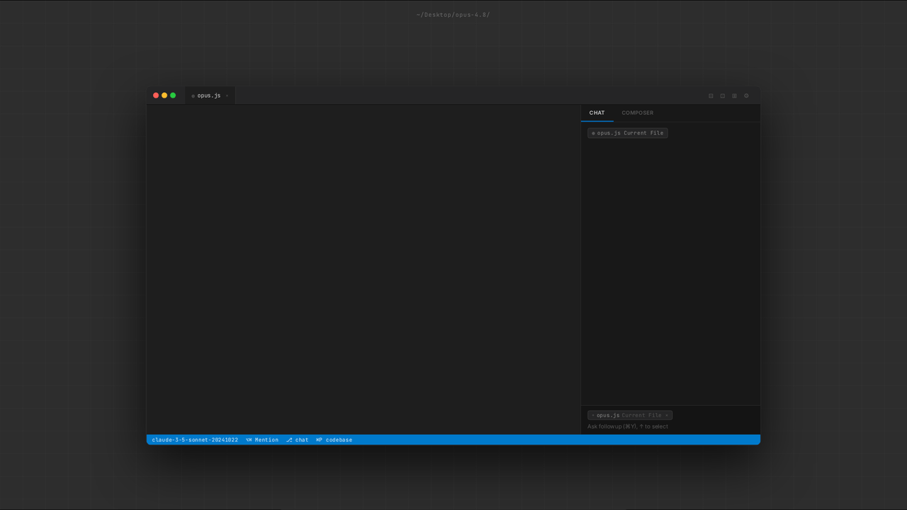

# Carryover

<p align="center">
  
</p>

<p align="center"><b>Persistent context for AI agents — without burning context.</b></p>

<p align="center">
  <a href="https://github.com/carryover-dev/carryover/actions/workflows/codeql.yml"></a>
  <a href="https://www.npmjs.com/package/carryover"></a>
  <a href="https://crates.io/crates/carryover"></a>
  <a href="LICENSE"></a>
  <a href="https://github.com/carryover-dev/carryover/issues/3"></a>
  <a href="https://github.com/carryover-dev/carryover/discussions"></a>
</p>

---

**Status: alpha — v0.1.0 in pre-release.**

<p align="center">
  
</p>

<p align="center"><sub>Demo recorded on macOS at v0.1.0 ship; placeholder until then.</sub></p>

## What is Carryover?

Carryover is a long-lived local daemon that captures AI agent context from on-disk transcripts and republishes a structured handoff: task, open questions, next action, and a cumulative progress log. Your agent stays focused across session boundaries, tool switches, and compaction events — whether you're shipping a feature, mapping a competitive landscape, or drafting an investor memo. The bookkeeping happens locally so the agent itself never has to do the work.

## Why does this exist?

AI agents already write a complete transcript of every session to disk — Claude Code as JSONL under `~/.claude/projects/`, Codex CLI under `~/.codex/sessions/`, Cursor as SQLite under VS Code's workspace storage, Aider as Markdown in the working tree, and so on. Yet every existing handoff tool asks the agent to summarize itself, write a markdown file, or call an MCP tool — work the agent has to perform inside its own context window.

Carryover takes a different path. The state is already on disk. A local daemon reads it, distills a bounded handoff, and writes it back where the next session — same tool or different — will pick it up. The agent never sees the bookkeeping, so the work happens without burning context.

That gives Carryover three properties no competitor has at once:

1. **Capture happens without burning context.** Hooks fire locally, the daemon reads transcripts directly, and the agent does no writing.
2. **Restore is bounded.** A structured handoff (task, progress log, next action) is the contract. Older state lives in the local SQLite ledger, not in the agent's prompt.
3. **It works across tools.** Claude Code, Cursor, Codex, Copilot, Windsurf, and Aider all converge on the same `AGENTS.md` rail.

## Architecture

A long-lived user daemon (`carryoverd`) started by `launchd` or `systemd` watches each tool's transcript directory and exposes a local hook endpoint at `localhost:47823`. Captured state flows through a normalizer and a deterministic distiller (regex, AST via tree-sitter, git metadata) into a SQLite ledger at `~/.carryover/ledger.sqlite`, then out to a structured handoff at `~/.carryover/handoff.md` and a `[CARRYOVER]` block inside the project's `AGENTS.md`.

For the full design — including the confirmed transcript-location matrix, the per-tool hook event matrix, the restore paths, and the comparison against existing tools — see [`ARCHITECTURE.md`](./ARCHITECTURE.md).

## Install

Pick whichever fits your stack. All three install commands result in the same `carryoverd` binary on your `$PATH`.

### Linux

```sh
# npm — works for any tool whose users already have Node installed
npm install -g carryover

# OR Cargo — for Rust developers who already have it
cargo install carryover
```

### macOS

The Homebrew tap ships shortly after the v0.1.0 Linux release. Until then, npm works on macOS:

```sh
npm install -g carryover
```

```sh
# After the tap publishes:
brew install carryover-dev/tap/carryover
```

> **macOS first-run note** — v0.1 binaries are signed with [cosign](https://github.com/sigstore/cosign) (free, transparent, open-source) but **not** with an Apple Developer ID. Gatekeeper may refuse to launch on first run. Strip the quarantine attribute once after install:
>
> ```sh
> xattr -d com.apple.quarantine $(which carryoverd)
> ```
>
> Apple Developer ID notarization is on the v1.0 roadmap — we accept the one-time `xattr` step in exchange for keeping the project free and signed via a public, transparent log. If you install via npm on macOS the postinstall script prints this same advisory automatically.

### Then run the one-time setup

```sh
carryoverd install
```

A single TUI question: *"Which AI agents do you use?"* — pre-checked with whatever Carryover detects on disk. Confirm and the daemon registers itself with systemd-user (on Linux), writes hook stubs into each tool's settings, and starts watching transcripts. macOS launchd registration ships with the Homebrew tap.

```sh
carryoverd status      # see what's installed and recent events
carryoverd refresh     # re-detect tools after a tool upgrade
carryoverd uninstall   # remove hooks; ledger preserved by default (--purge to wipe)
```

## What works in v0.1

| Feature | Status |
|---|---|
| Capture from Claude Code (`~/.claude/projects/*.jsonl`) | ✅ |
| Capture from Cursor (`state.vscdb` SQLite, with WAL-locked copy fallback) | ✅ |
| Capture from Codex CLI (`~/.codex/sessions/*.jsonl`) | ✅ |
| Distilled handoff with task / open questions / next action / recent files / failed approaches / git context / progress log | ✅ |
| Privacy-split dual-write (`.carryover/handoff.md` gitignored, fixed pointer block in `AGENTS.md` + `CLAUDE.md`) | ✅ |
| Hook endpoint on `127.0.0.1:47823` (loopback only, DNS-rebinding guard, body size cap) | ✅ |
| fs watcher backup signal (notify + debouncer) | ✅ |
| Linux daemon registration via systemd-user | ✅ |
| macOS daemon registration via launchd | shipping with the Homebrew tap |
| Cross-tool integration test (Claude → Cursor / Cursor → Codex / Codex → Cursor / Claude → Codex) | ✅ |
| `cosign verify-blob` keyless signing on every release artifact | ✅ |

## What's deferred to v0.2+

- Aider, Copilot, Windsurf, Gemini CLI adapters (v0.2)
- `brief` and `silent` resume modes — v0.1 ships only `ask` (v0.3)
- Encryption-at-rest on the SQLite ledger (v0.5)
- Apple Developer ID + notarization (v1.0 — until then, `xattr` is the workaround)
- Windows support
- Team-shared / sync features
- GUI

## Verification

Every release artifact is signed with cosign keyless OIDC tied to **this exact workflow path** in this repository. To verify a downloaded tarball:

```sh
# Replace <ASSET> with the tarball name, e.g. carryoverd-v0.1.0-x86_64-unknown-linux-gnu.tar.gz
cosign verify-blob \
  --certificate "<ASSET>.pem" \
  --signature "<ASSET>.sig" \
  --certificate-identity-regexp "^https://github.com/carryover-dev/carryover/.github/workflows/release\.yml@refs/tags/v.*" \
  --certificate-oidc-issuer "https://token.actions.githubusercontent.com" \
  "<ASSET>"
```

`SHA256SUMS` covers every tarball on the release page; `npm install -g carryover` enforces this hash automatically and refuses to install a mismatched binary.

## Where to get help

- **Bugs and feature requests** — open a GitHub issue using the templates in `.github/ISSUE_TEMPLATE/`.
- **Design discussion and questions** — GitHub Discussions is the single focal point at launch. Chat platforms will be added only when traffic exceeds maintainer bandwidth.
- **Security disclosures** — see [`SECURITY.md`](./SECURITY.md). Do not file public issues for security reports.

The maintainer responds to new issues within seven days. See [`CONTRIBUTING.md`](./CONTRIBUTING.md) for the full commitment.

## Who is Carryover for?

Three target users, stated plainly:

- I think Carryover would really help **developers who switch between Cursor, Claude Code, and Codex on the same project**, who are trying to **carry intent and recent decisions across tools without manually re-explaining the state**.
- I think Carryover would really help **founders running long sessions on strategy, fundraising, market research, or competitive analysis with Claude Code**, who are trying to **keep weeks of context across `PreCompact` and tool restarts without losing the thread**.
- I think Carryover would really help **researchers and long-form writers using AI agents for synthesis, drafting, and source-tracking**, who are trying to **preserve outlines, decisions, and reference lists across session boundaries**.

## Project links

- [Architecture](./ARCHITECTURE.md)
- [Vision](./VISION.md)
- [Roadmap](./ROADMAP.md)
- [Governance](./GOVERNANCE.md)
- [Contributing](./CONTRIBUTING.md)
- [Code of Conduct](./CODE_OF_CONDUCT.md)
- [Security policy](./SECURITY.md)
- [Changelog](./CHANGELOG.md)
- [License (Apache 2.0)](./LICENSE)
